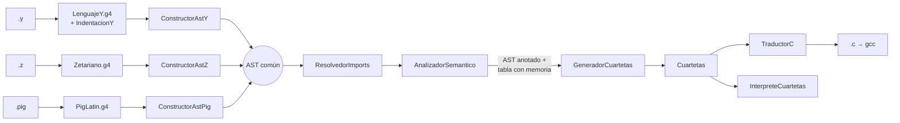
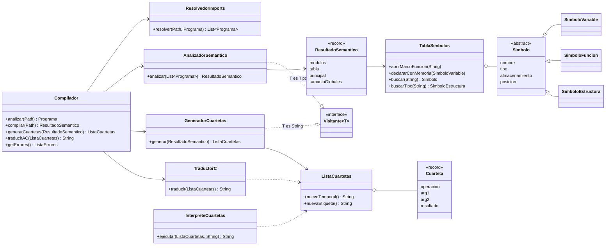
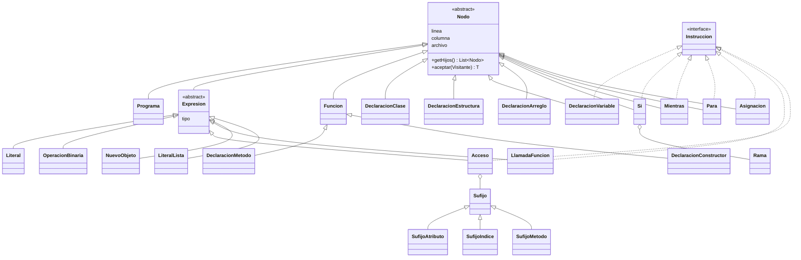
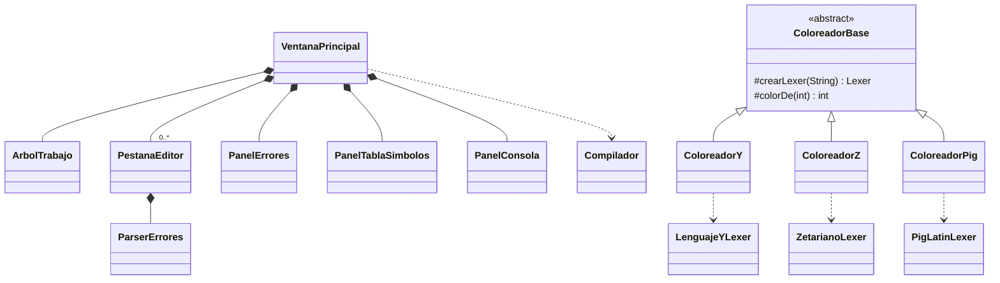

# Manual técnico — Contacto 3xtrat3rr3str3D

Proyecto 1 · Organización de Lenguajes y Compiladores 2 · USAC, Centro Universitario de
Occidente · Segundo semestre 2026

Compilador de tres lenguajes de alto nivel —**Y?** (`.y`), **Zetariano** (`.z`) y
**PigLatin** (`.pig`)— que valida el programa (léxico, sintaxis y semántica), genera
**código de tres direcciones con cuartetas** y lo traduce a un archivo **C** que compila con
gcc.

---

## 1. Tecnologías utilizadas

| Tecnología | Versión | Para qué |
|---|---|---|
| Java | 21 | Lenguaje del compilador y de la interfaz (se usa *pattern matching* en `switch` y `record`) |
| Maven | 3.9 | Construcción; genera los analizadores y arma un `.jar` ejecutable con todo adentro |
| ANTLR | 4.13.2 | Genera los lexers y parsers de los tres lenguajes (`antlr4-maven-plugin`) |
| Swing + FlatLaf | 3.5.4 | Interfaz gráfica con tema oscuro |
| RSyntaxTextArea | 3.5.4 | Componente de editor (números de línea, subrayado de errores). **No se usa su coloreado**: ver 6.2 |
| gcc | C11 | Compila el código C generado (solo para ejecutarlo; el compilador no lo necesita) |

---

## 2. Arquitectura

La decisión central: **un solo AST para los tres lenguajes**. Cada lenguaje tiene su
gramática y su constructor, pero todos producen los mismos nodos; de ahí en adelante hay un
solo analizador semántico, un solo generador de cuartetas y un solo traductor a C.



| Paquete | Contenido |
|---|---|
| `parser` (generado) | Lexers y parsers de ANTLR; `IndentacionY` convierte la indentación de Y? en `INDENT`/`DEDENT` |
| `errores` | `ListaErrores`, `ErrorCompilacion` y los *listeners* que traducen los errores de ANTLR al español |
| `ast` | Los 37 nodos (`declaraciones`, `instrucciones`, `expresiones`), `Tipo` y la interfaz `Visitante` |
| `constructores` | `ConstructorAstY`, `ConstructorAstZ`, `ConstructorAstPig`: *parse tree* → AST común |
| `semantico` | `ResolvedorImports`, `AnalizadorSemantico`, `Compatibilidad` (reglas de tipos), `EvaluadorConstantes` |
| `simbolos` | `TablaSimbolos` con ámbitos, `SimboloVariable`, `SimboloFuncion`, `SimboloEstructura` (offsets) |
| `c3d` | `Cuarteta`, `Operacion`, `ListaCuartetas`, `GeneradorCuartetas` e `InterpreteCuartetas` |
| `generador` | `TraductorC` |
| `ui` | Ventana, árbol de trabajo, editor, coloreadores propios, paneles de resultados |
| (raíz) | `Main` (interfaz) y `Compilador` (orquesta todo; también se usa desde consola) |

---

## 3. Diagramas de clases

### 3.1 El compilador



### 3.2 El AST



`Instruccion` es **interfaz** porque hay nodos que son expresión e instrucción a la vez
(`calcular(10)` se usa por su valor o por su efecto). El diagrama muestra las clases
principales; la lista completa son los 37 métodos de `Visitante`.

### 3.3 La interfaz



---

## 4. Especificación léxica y gramáticas

Las tres gramáticas están en `src/main/antlr4/com/usac/contacto3d/parser/`. En las tres:

- Espacios y comentarios van al **canal oculto** (`-> channel(HIDDEN)`), no a `skip`: el
  parser los ignora igual, pero el coloreado los necesita para pintar cada línea completa.
- La **precedencia** sale del orden de las alternativas de `expr` (la primera es la más
  alta): agrupación, unarios, `* / %`, `+ -`, relacionales, igualdad, `&&`, `||` y, en
  Zetariano, el ternario (asociativo a la derecha).
- **Todas las alternativas llevan etiqueta** (`# exprSumRes`), así ANTLR genera un método de
  visita por construcción.

**Literales comunes:** entero `[0-9]+`; decimal `[0-9]+ '.' [0-9]+`; cadena entre comillas
dobles con escapes `\n \t \" \\`; carácter entre comillas simples; identificador
`[a-zA-Z_][a-zA-Z0-9_]*`.

| | Comentario de línea | Comentario de bloque |
|---|---|---|
| Y? | `// ...` | `/* ... */` |
| Zetariano | `// ...` | `/* ... */` |
| PigLatin | `// ...` | `## ... ##` |

### 4.1 La indentación de Y?

Y? define los bloques con la indentación, como Python, y ANTLR no la maneja solo.
`IndentacionY` se mete entre el lexer y el parser y lleva una **pila de niveles**:

- al empezar una línea mide la sangría (un tab avanza al siguiente múltiplo de 4);
- si es mayor que el tope, apila y emite `INDENT`; si es menor, desapila y emite un
  `DEDENT` por cada nivel que cierra; al final del archivo cierra lo que quede abierto;
- las líneas vacías o con solo comentarios no cuentan;
- dentro de un literal `{ ... }` los saltos de línea se ignoran (matrices en varias líneas);
- una sangría que no coincide con ningún nivel es error léxico.

Así un bloque en la gramática es `NUEVA_LINEA INDENT instruccion+ DEDENT`.

### 4.2 Y? (`LenguajeY.g4`)

**Palabras reservadas y marcadores** (sensibles a mayusculas):

`%estructuras` `%funciones` `entero` `flotante` `cadena` `caracter` `bool` `estructura` `definir` `retornar` `si` `sino` `contrario` `entonces` `elegir` `caso` `siempre` `romper` `continuar` `para` `mientras` `hacer` `imprimir` `leer` `verdadero` `falso`

**Simbolos:**

| Token | Simbolo |
|---|---|
| `FLECHA` | `->` |
| `INCREMENTO` | `++` |
| `DECREMENTO` | `--` |
| `IGUALDAD` | `==` |
| `DIFERENTE` | `!=` |
| `MENOR_IGUAL` | `<=` |
| `MAYOR_IGUAL` | `>=` |
| `AND` | `&&` |
| `OR` | `&#124;&#124;` |
| `MAS` | `+` |
| `MENOS` | `-` |
| `POR` | `*` |
| `DIV` | `/` |
| `MENOR` | `<` |
| `MAYOR` | `>` |
| `NOT` | `!` |
| `ASIGNACION` | `=` |
| `PAR_A` | `(` |
| `PAR_C` | `)` |
| `CORCH_A` | `[` |
| `CORCH_C` | `]` |
| `LLAVE_A` | `{` |
| `LLAVE_C` | `}` |
| `PUNTO` | `.` |
| `COMA` | `,` |
| `DOSP` | `:` |
| `PUNTOYCOMA` | `;` |

<details><summary>Reglas sintacticas de Y?</summary>

```antlr
programa
    : (SEC_ESTRUCTURAS NUEVA_LINEA estructura*)?
      SEC_FUNCIONES NUEVA_LINEA funcion*
      EOF
    ;

estructura
    : ESTRUCTURA ID DOSP NUEVA_LINEA INDENT campo+ DEDENT
    ;

campo
    : tipo ID dimensionConstante* NUEVA_LINEA
    ;

dimensionConstante
    : CORCH_A LIT_ENTERO CORCH_C
    ;

funcion
    : DEFINIR ID PAR_A listaParametros? PAR_C (FLECHA tipo)? DOSP bloque
    ;

listaParametros
    : parametro (COMA parametro)*
    ;

parametro
    : tipo ID
    | (CORCH_A CORCH_C)+ tipo ID
    | LLAVE_A LLAVE_C ID ID
    ;

tipo
    : ENTERO
    | FLOTANTE
    | CADENA
    | CARACTER
    | BOOL
    | ID
    ;

bloque
    : NUEVA_LINEA INDENT instruccion+ DEDENT
    ;

instruccion
    : instruccionSimple PUNTOYCOMA? NUEVA_LINEA
    | estructura
    | sentenciaSi
    | sentenciaElegir
    | sentenciaPara
    | sentenciaMientras
    | sentenciaHacer

    | INDENT instruccion+ DEDENT

    ;

instruccionSimple
    : declaracion
    | asignacion
    | incremento
    | llamada
    | IMPRIMIR PAR_A listaExpresiones? PAR_C
    | LEER PAR_A PAR_C
    | RETORNAR expr?
    | ROMPER
    | CONTINUAR
    ;

declaracion
    : tipo ID dimension* (ASIGNACION expr)?
    ;

dimension
    : CORCH_A expr CORCH_C
    ;

asignacion
    : acceso ASIGNACION expr
    ;

incremento
    : acceso (INCREMENTO | DECREMENTO)
    ;

sentenciaSi
    : SI PAR_A expr PAR_C ENTONCES DOSP? bloque
      ramaSino*
      ramaContrario?
    ;

ramaSino
    : SINO PAR_A expr PAR_C ENTONCES DOSP? bloque
    ;

ramaContrario
    : CONTRARIO DOSP? bloque
    ;

sentenciaElegir
    : ELEGIR PAR_A expr PAR_C LLAVE_A NUEVA_LINEA
      (INDENT caso* casoSiempre? DEDENT)?
      LLAVE_C NUEVA_LINEA
    ;

caso
    : CASO expr DOSP cuerpoCaso
    ;

casoSiempre
    : SIEMPRE DOSP cuerpoCaso
    ;

cuerpoCaso
    : bloque
    | instruccionSimple PUNTOYCOMA? NUEVA_LINEA
    | NUEVA_LINEA
    ;

sentenciaPara
    : PARA PAR_A inicioPara PUNTOYCOMA expr PUNTOYCOMA actualizacionPara PAR_C DOSP bloque
    ;

inicioPara
    : declaracion
    | asignacion
    ;

actualizacionPara
    : incremento
    | asignacion
    ;

sentenciaMientras
    : MIENTRAS PAR_A expr PAR_C HACER DOSP? bloque
    ;

sentenciaHacer
    : HACER DOSP bloque MIENTRAS PAR_A expr PAR_C PUNTOYCOMA? NUEVA_LINEA
    ;

expr
    : PAR_A expr PAR_C
    | (MENOS | NOT) expr
    | expr (POR | DIV) expr
    | expr (MAS | MENOS) expr
    | expr (MENOR | MAYOR | MENOR_IGUAL | MAYOR_IGUAL) expr
    | expr (IGUALDAD | DIFERENTE) expr
    | expr AND expr
    | expr OR expr
    | literal
    | llamada
    | acceso
    | LEER PAR_A PAR_C
    | LLAVE_A listaExpresiones? LLAVE_C
    ;

listaExpresiones
    : expr (COMA expr)*
    ;

llamada
    : ID PAR_A listaExpresiones? PAR_C
    ;

acceso
    : ID sufijo*
    ;

sufijo
    : PUNTO ID
    | CORCH_A expr CORCH_C
    ;

literal
    : LIT_ENTERO
    | LIT_FLOTANTE
    | LIT_CADENA
    | LIT_CARACTER
    | (VERDADERO | FALSO)
    ;
```
</details>

### 4.3 Zetariano (`Zetariano.g4`)

**Palabras reservadas y marcadores** (sensibles a mayusculas):

`int` `double` `char` `boolean` `String` `void` `public` `private` `class` `new` `this` `null` `true` `false` `if` `else` `switch` `case` `default` `break` `continue` `return` `for` `while` `do` `println` `print` `readln` `%`

**Simbolos:**

| Token | Simbolo |
|---|---|
| `INCREMENTO` | `++` |
| `DECREMENTO` | `--` |
| `MAS_IGUAL` | `+=` |
| `MENOS_IGUAL` | `-=` |
| `POR_IGUAL` | `*=` |
| `IGUALDAD` | `==` |
| `DIFERENTE` | `!=` |
| `MENOR_IGUAL` | `<=` |
| `MAYOR_IGUAL` | `>=` |
| `AND` | `&&` |
| `OR` | `&#124;&#124;` |
| `MAS` | `+` |
| `MENOS` | `-` |
| `POR` | `*` |
| `DIV` | `/` |
| `MENOR` | `<` |
| `MAYOR` | `>` |
| `NOT` | `!` |
| `ASIGNACION` | `=` |
| `INTERROGACION` | `?` |
| `PAR_A` | `(` |
| `PAR_C` | `)` |
| `CORCH_A` | `[` |
| `CORCH_C` | `]` |
| `LLAVE_A` | `{` |
| `LLAVE_C` | `}` |
| `PUNTO` | `.` |
| `COMA` | `,` |
| `DOSP` | `:` |
| `PUNTOYCOMA` | `;` |

<details><summary>Reglas sintacticas de Zetariano</summary>

```antlr
programa
    : clase EOF
    ;

clase
    : modificador? CLASS ID LLAVE_A miembro* LLAVE_C
    ;

modificador
    : PUBLIC
    | PRIVATE
    ;

miembro
    : modificador? ID PAR_A listaParametros? PAR_C bloque
    | modificador? VOID ID PAR_A listaParametros? PAR_C bloque
    | modificador? tipo ID restoMiembro
    ;

restoMiembro
    : PAR_A listaParametros? PAR_C bloque
    | (ASIGNACION expr)? (COMA declarador)* PUNTOYCOMA
    ;

listaParametros
    : parametro (COMA parametro)*
    ;

parametro
    : tipo ID
    ;

tipo
    : tipoBase (CORCH_A CORCH_C)*
    ;

tipoBase
    : INT
    | DOUBLE
    | CHAR
    | BOOLEAN
    | STRING
    | ID
    ;

bloque
    : LLAVE_A instruccion* LLAVE_C
    ;

instruccion
    : bloque
    | declaracionVariable PUNTOYCOMA
    | asignacion PUNTOYCOMA
    | incremento PUNTOYCOMA

    | acceso PUNTOYCOMA
    | sentenciaIf
    | sentenciaSwitch
    | sentenciaFor
    | sentenciaWhile
    | sentenciaDoWhile
    | PRINTLN PAR_A expr? PAR_C PUNTOYCOMA
    | PRINT PAR_A expr PAR_C PUNTOYCOMA
    | READLN PAR_A PAR_C PUNTOYCOMA
    | BREAK PUNTOYCOMA
    | CONTINUE PUNTOYCOMA
    | RETURN expr? PUNTOYCOMA
    ;

declaracionVariable
    : tipo declarador (COMA declarador)*
    ;

declarador
    : ID (ASIGNACION expr)?
    ;

asignacion
    : acceso (ASIGNACION | MAS_IGUAL | MENOS_IGUAL | POR_IGUAL) expr
    ;

incremento
    : acceso (INCREMENTO | DECREMENTO)
    | (INCREMENTO | DECREMENTO) acceso
    ;

sentenciaIf
    : IF PAR_A expr PAR_C instruccion (ELSE instruccion)?
    ;

sentenciaSwitch
    : SWITCH PAR_A expr PAR_C LLAVE_A seccionSwitch* LLAVE_C
    ;

seccionSwitch
    : CASE expr DOSP instruccion*
    | DEFAULT DOSP instruccion*
    ;

sentenciaFor
    : FOR PAR_A inicioFor? PUNTOYCOMA expr? PUNTOYCOMA listaActualizacion? PAR_C instruccion
    ;

inicioFor
    : declaracionVariable
    | listaActualizacion
    ;

listaActualizacion
    : actualizacion (COMA actualizacion)*
    ;

actualizacion
    : asignacion
    | incremento
    ;

sentenciaWhile
    : WHILE PAR_A expr PAR_C instruccion
    ;

sentenciaDoWhile
    : DO instruccion WHILE PAR_A expr PAR_C PUNTOYCOMA
    ;

expr
    : PAR_A expr PAR_C
    | incremento
    | (MENOS | NOT) expr
    | expr (POR | DIV | MOD) expr
    | expr (MAS | MENOS) expr
    | expr (MENOR | MAYOR | MENOR_IGUAL | MAYOR_IGUAL) expr
    | expr (IGUALDAD | DIFERENTE) expr
    | expr AND expr
    | expr OR expr
    | <assoc=right> expr INTERROGACION expr DOSP expr
    | literal
    | acceso
    | NEW ID PAR_A listaExpresiones? PAR_C
    | NEW tipoBase (CORCH_A expr CORCH_C)+
    | LLAVE_A listaExpresiones? LLAVE_C
    | READLN PAR_A PAR_C
    ;

listaExpresiones
    : expr (COMA expr)*
    ;

acceso
    : raizAcceso sufijo*
    ;

raizAcceso
    : ID PAR_A listaExpresiones? PAR_C
    | ID
    | THIS
    ;

sufijo
    : PUNTO ID PAR_A listaExpresiones? PAR_C
    | PUNTO ID
    | CORCH_A expr CORCH_C
    ;

literal
    : LIT_ENTERO
    | LIT_DECIMAL
    | LIT_CADENA
    | LIT_CARACTER
    | (TRUE | FALSE)
    | NULL
    ;
```
</details>

### 4.4 PigLatin (`PigLatin.g4`)

**Palabras reservadas y marcadores** (sensibles a mayusculas):

`VARIABILES>` `MUNERA>` `MAIOR>` `VARIABILES[` `FINIS` `numerus` `decimalis` `textum` `littera` `bool` `import` `esto` `structura` `series` `novus` `finis` `si` `aliter` `dum` `facere` `per` `perge` `interrumpe` `actio` `ratio` `reddere` `verum` `falsus` `non`

**Simbolos:**

| Token | Simbolo |
|---|---|
| `IMPRIMIR` | `>>` |
| `LEER` | `<<` |
| `INCREMENTO` | `++` |
| `DECREMENTO` | `--` |
| `IGUALDAD` | `==` |
| `DIFERENTE` | `!=` |
| `MENOR_IGUAL` | `<=` |
| `MAYOR_IGUAL` | `>=` |
| `AND` | `&&` |
| `OR` | `&#124;&#124;` |
| `MAS` | `+` |
| `MENOS` | `-` |
| `POR` | `*` |
| `DIV` | `/` |
| `MENOR` | `<` |
| `MAYOR` | `>` |
| `ASIGNACION` | `=` |
| `PAR_A` | `(` |
| `PAR_C` | `)` |
| `CORCH_A` | `[` |
| `CORCH_C` | `]` |
| `LLAVE_A` | `{` |
| `LLAVE_C` | `}` |
| `PUNTO` | `.` |
| `COMA` | `,` |
| `DOSP` | `:` |
| `PUNTOYCOMA` | `;` |

<details><summary>Reglas sintacticas de PigLatin</summary>

```antlr
programa
    : importacion*
      (SEC_VARIABILES declaracion*)?
      (SEC_MUNERA funcion*)?
      SEC_MAIOR instruccion* FINIS_MAIOR PUNTOYCOMA
      EOF
    ;

importacion
    : IMPORT ID (PUNTO ID)+ PUNTOYCOMA?
    ;

declaracion
    : declaracionVariable
    | declaracionArreglo

    | STRUCTURA ID LLAVE_A declaracion* LLAVE_C FINIS PUNTOYCOMA

    ;

declaracionVariable
    : ESTO ID DOSP tipoPrimitivo expr? PUNTOYCOMA

    | ESTO ID DOSP (VERUM | FALSUS) PUNTOYCOMA
    | ESTO ID DOSP ID listaValores PUNTOYCOMA?

    | ESTO ID DOSP ID PUNTOYCOMA
    | ESTO ID DOSP nuevoObjeto PUNTOYCOMA
    ;

declaracionArreglo
    : SERIES ID dimension+ DOSP tipo (listaValores PUNTOYCOMA? | PUNTOYCOMA)
    ;

dimension
    : CORCH_A expr CORCH_C
    ;

listaValores
    : LLAVE_A (valor (COMA valor)*)? LLAVE_C
    ;

valor
    : expr
    | listaValores
    ;

tipo
    : tipoPrimitivo
    | ID
    ;

tipoPrimitivo
    : NUMERUS
    | DECIMALIS
    | TEXTUM
    | LITTERA
    | BOOL
    ;

funcion
    : ACTIO ID PAR_A listaParametros? PAR_C cuerpoFuncion
    | RATIO tipo ID PAR_A listaParametros? PAR_C cuerpoFuncion
    ;

listaParametros
    : parametro (COMA parametro)*
    ;

parametro
    : ESTO ID DOSP tipo
    ;

cuerpoFuncion
    : LLAVE_A bloqueVariables? instruccion* LLAVE_C FINIS PUNTOYCOMA
    ;

bloqueVariables
    : VAR_BLOQUE declaracion* CORCH_C
    ;

instruccion
    : declaracionVariable
    | declaracionArreglo
    | asignacion
    | incremento PUNTOYCOMA

    | acceso PUNTOYCOMA
    | sentenciaSi
    | sentenciaDum
    | sentenciaFacere
    | sentenciaPer
    | PERGE PUNTOYCOMA
    | INTERRUMPE PUNTOYCOMA
    | REDDERE expr? PUNTOYCOMA
    | IMPRIMIR expr (IMPRIMIR expr)* PUNTOYCOMA

    | acceso LEER PUNTOYCOMA?
    | LEER PUNTOYCOMA?
    ;

asignacion
    : acceso ASIGNACION expr PUNTOYCOMA
    | acceso ASIGNACION listaValores PUNTOYCOMA?
    ;

incremento
    : acceso (INCREMENTO | DECREMENTO)
    ;

sentenciaSi
    : SI PAR_A expr PAR_C bloque ramaAliterSi* ramaAliter? FINIS PUNTOYCOMA
    ;

ramaAliterSi
    : ALITER PAR_A expr PAR_C bloque
    ;

ramaAliter
    : ALITER bloque
    ;

sentenciaDum
    : DUM PAR_A expr PAR_C bloque FINIS PUNTOYCOMA
    ;

sentenciaFacere
    : FACERE bloque DUM PAR_A expr PAR_C PUNTOYCOMA
    ;

sentenciaPer
    : PER PAR_A inicioPer PUNTOYCOMA expr PUNTOYCOMA actualizacionPer PAR_C bloque
      (FINIS PUNTOYCOMA?)?
    ;

inicioPer
    : ESTO ID DOSP tipo expr
    | acceso ASIGNACION expr
    ;

actualizacionPer
    : incremento
    | acceso ASIGNACION expr
    ;

bloque
    : LLAVE_A instruccion* LLAVE_C
    ;

expr
    : PAR_A expr PAR_C
    | incremento
    | (MENOS | NON) expr
    | expr (POR | DIV) expr
    | expr (MAS | MENOS) expr
    | expr (MENOR | MAYOR | MENOR_IGUAL | MAYOR_IGUAL) expr
    | expr (IGUALDAD | DIFERENTE) expr
    | expr AND expr
    | expr OR expr
    | literal
    | acceso
    | nuevoObjeto
    ;

nuevoObjeto
    : NOVUS ID PAR_A listaExpresiones? PAR_C
    ;

listaExpresiones
    : expr (COMA expr)*
    ;

acceso
    : raizAcceso sufijo*
    ;

raizAcceso
    : ID PAR_A listaExpresiones? PAR_C
    | ID
    ;

sufijo
    : PUNTO ID PAR_A listaExpresiones? PAR_C
    | PUNTO ID
    | CORCH_A expr CORCH_C
    ;

literal
    : LIT_ENTERO
    | LIT_DECIMAL
    | LIT_CADENA
    | LIT_CARACTER
    | (VERUM | FALSUS)
    ;
```
</details>

---

## 5. Tabla de compatibilidad de tipos

Se genera a partir de `semantico/Compatibilidad`, la misma clase que usa el analizador, así que
no puede diferir de lo que el compilador hace. Las reglas son las mismas en los tres lenguajes;
solo cambian los nombres de los tipos.

**Jerarquía** (al operar gana la más alta): cadena 5 > flotante 4 > entero 3 > carácter 2 > bool 1.
Asignar solo puede **ampliar** dentro de la familia numérica (carácter → entero → flotante); bool y
cadena exigen el mismo tipo. `null` (Zetariano) se puede asignar a objetos, arreglos y cadenas.

### 5.1 Y?

**Suma `+` (con una cadena, concatena)** — fila: operando izquierdo, columna: operando derecho

| | **entero** | **flotante** | **cadena** | **caracter** | **bool** |
|---|---|---|---|---|---|
| **entero** | entero | flotante | cadena | entero | entero |
| **flotante** | flotante | flotante | cadena | flotante | flotante |
| **cadena** | cadena | cadena | cadena | cadena | cadena |
| **caracter** | entero | flotante | cadena | caracter | caracter |
| **bool** | entero | flotante | cadena | caracter | bool |

**Resta, multiplicacion y division `-` `*` `/`** — fila: operando izquierdo, columna: operando derecho

| | **entero** | **flotante** | **cadena** | **caracter** | **bool** |
|---|---|---|---|---|---|
| **entero** | entero | flotante | error | entero | entero |
| **flotante** | flotante | flotante | error | flotante | flotante |
| **cadena** | error | error | error | error | error |
| **caracter** | entero | flotante | error | caracter | caracter |
| **bool** | entero | flotante | error | caracter | bool |

**Relacionales `<` `>` `<=` `>=`** — fila: operando izquierdo, columna: operando derecho

| | **entero** | **flotante** | **cadena** | **caracter** | **bool** |
|---|---|---|---|---|---|
| **entero** | bool | bool | error | bool | bool |
| **flotante** | bool | bool | error | bool | bool |
| **cadena** | error | error | error | error | error |
| **caracter** | bool | bool | error | bool | bool |
| **bool** | bool | bool | error | bool | bool |

**Igualdad `==` `!=`** — fila: operando izquierdo, columna: operando derecho

| | **entero** | **flotante** | **cadena** | **caracter** | **bool** |
|---|---|---|---|---|---|
| **entero** | bool | bool | error | bool | bool |
| **flotante** | bool | bool | error | bool | bool |
| **cadena** | error | error | bool | error | error |
| **caracter** | bool | bool | error | bool | bool |
| **bool** | bool | bool | error | bool | bool |

**Logicos `&&` `||` (negacion: `!`)** — fila: operando izquierdo, columna: operando derecho

| | **entero** | **flotante** | **cadena** | **caracter** | **bool** |
|---|---|---|---|---|---|
| **entero** | error | error | error | error | error |
| **flotante** | error | error | error | error | error |
| **cadena** | error | error | error | error | error |
| **caracter** | error | error | error | error | error |
| **bool** | error | error | error | error | bool |

**Asignacion, paso de parametros y retorno** — fila: tipo del destino, columna: tipo del valor

| destino \ valor | **entero** | **flotante** | **cadena** | **caracter** | **bool** |
|---|---|---|---|---|---|
| **entero** | si | no (pierde informacion) | no | si | no |
| **flotante** | si | si | no | si | no |
| **cadena** | no | no | si | no | no |
| **caracter** | no (pierde informacion) | no (pierde informacion) | no | si | no |
| **bool** | no | no | no | no | si |

### 5.2 Zetariano

**Suma `+` (con una cadena, concatena)** — fila: operando izquierdo, columna: operando derecho

| | **int** | **double** | **String** | **char** | **boolean** |
|---|---|---|---|---|---|
| **int** | int | double | String | int | int |
| **double** | double | double | String | double | double |
| **String** | String | String | String | String | String |
| **char** | int | double | String | char | char |
| **boolean** | int | double | String | char | boolean |

**Resta, multiplicacion y division `-` `*` `/`** — fila: operando izquierdo, columna: operando derecho

| | **int** | **double** | **String** | **char** | **boolean** |
|---|---|---|---|---|---|
| **int** | int | double | error | int | int |
| **double** | double | double | error | double | double |
| **String** | error | error | error | error | error |
| **char** | int | double | error | char | char |
| **boolean** | int | double | error | char | boolean |

**Modulo `%`** — fila: operando izquierdo, columna: operando derecho

| | **int** | **double** | **String** | **char** | **boolean** |
|---|---|---|---|---|---|
| **int** | int | error | error | int | error |
| **double** | error | error | error | error | error |
| **String** | error | error | error | error | error |
| **char** | int | error | error | int | error |
| **boolean** | error | error | error | error | error |

**Relacionales `<` `>` `<=` `>=`** — fila: operando izquierdo, columna: operando derecho

| | **int** | **double** | **String** | **char** | **boolean** |
|---|---|---|---|---|---|
| **int** | boolean | boolean | error | boolean | boolean |
| **double** | boolean | boolean | error | boolean | boolean |
| **String** | error | error | error | error | error |
| **char** | boolean | boolean | error | boolean | boolean |
| **boolean** | boolean | boolean | error | boolean | boolean |

**Igualdad `==` `!=`** — fila: operando izquierdo, columna: operando derecho

| | **int** | **double** | **String** | **char** | **boolean** |
|---|---|---|---|---|---|
| **int** | boolean | boolean | error | boolean | boolean |
| **double** | boolean | boolean | error | boolean | boolean |
| **String** | error | error | boolean | error | error |
| **char** | boolean | boolean | error | boolean | boolean |
| **boolean** | boolean | boolean | error | boolean | boolean |

**Logicos `&&` `||` (negacion: `!`)** — fila: operando izquierdo, columna: operando derecho

| | **int** | **double** | **String** | **char** | **boolean** |
|---|---|---|---|---|---|
| **int** | error | error | error | error | error |
| **double** | error | error | error | error | error |
| **String** | error | error | error | error | error |
| **char** | error | error | error | error | error |
| **boolean** | error | error | error | error | boolean |

**Asignacion, paso de parametros y retorno** — fila: tipo del destino, columna: tipo del valor

| destino \ valor | **int** | **double** | **String** | **char** | **boolean** |
|---|---|---|---|---|---|
| **int** | si | no (pierde informacion) | no | si | no |
| **double** | si | si | no | si | no |
| **String** | no | no | si | no | no |
| **char** | no (pierde informacion) | no (pierde informacion) | no | si | no |
| **boolean** | no | no | no | no | si |

### 5.3 PigLatin

**Suma `+` (con una cadena, concatena)** — fila: operando izquierdo, columna: operando derecho

| | **numerus** | **decimalis** | **textum** | **littera** | **bool** |
|---|---|---|---|---|---|
| **numerus** | numerus | decimalis | textum | numerus | numerus |
| **decimalis** | decimalis | decimalis | textum | decimalis | decimalis |
| **textum** | textum | textum | textum | textum | textum |
| **littera** | numerus | decimalis | textum | littera | littera |
| **bool** | numerus | decimalis | textum | littera | bool |

**Resta, multiplicacion y division `-` `*` `/`** — fila: operando izquierdo, columna: operando derecho

| | **numerus** | **decimalis** | **textum** | **littera** | **bool** |
|---|---|---|---|---|---|
| **numerus** | numerus | decimalis | error | numerus | numerus |
| **decimalis** | decimalis | decimalis | error | decimalis | decimalis |
| **textum** | error | error | error | error | error |
| **littera** | numerus | decimalis | error | littera | littera |
| **bool** | numerus | decimalis | error | littera | bool |

**Relacionales `<` `>` `<=` `>=`** — fila: operando izquierdo, columna: operando derecho

| | **numerus** | **decimalis** | **textum** | **littera** | **bool** |
|---|---|---|---|---|---|
| **numerus** | bool | bool | error | bool | bool |
| **decimalis** | bool | bool | error | bool | bool |
| **textum** | error | error | error | error | error |
| **littera** | bool | bool | error | bool | bool |
| **bool** | bool | bool | error | bool | bool |

**Igualdad `==` `!=`** — fila: operando izquierdo, columna: operando derecho

| | **numerus** | **decimalis** | **textum** | **littera** | **bool** |
|---|---|---|---|---|---|
| **numerus** | bool | bool | error | bool | bool |
| **decimalis** | bool | bool | error | bool | bool |
| **textum** | error | error | bool | error | error |
| **littera** | bool | bool | error | bool | bool |
| **bool** | bool | bool | error | bool | bool |

**Logicos `&&` `||` (negacion: `non`)** — fila: operando izquierdo, columna: operando derecho

| | **numerus** | **decimalis** | **textum** | **littera** | **bool** |
|---|---|---|---|---|---|
| **numerus** | error | error | error | error | error |
| **decimalis** | error | error | error | error | error |
| **textum** | error | error | error | error | error |
| **littera** | error | error | error | error | error |
| **bool** | error | error | error | error | bool |

**Asignacion, paso de parametros y retorno** — fila: tipo del destino, columna: tipo del valor

| destino \ valor | **numerus** | **decimalis** | **textum** | **littera** | **bool** |
|---|---|---|---|---|---|
| **numerus** | si | no (pierde informacion) | no | si | no |
| **decimalis** | si | si | no | si | no |
| **textum** | no | no | si | no | no |
| **littera** | no (pierde informacion) | no (pierde informacion) | no | si | no |
| **bool** | no | no | no | no | si |


---

## 6. Análisis semántico

### 6.1 Validaciones

| Categoría | Qué se reporta |
|---|---|
| Declaraciones | variable, función, clase o tipo no declarado; redeclaración en el mismo ámbito; campo o atributo repetido; función, método o constructor con firma repetida; estructura que se contiene a sí misma |
| Tipos | asignación incompatible o que pierde información; operación inválida (la cadena solo admite `+`); condición no booleana en `si`, ciclos y ternario; ramas del ternario incompatibles |
| Accesos | campo o atributo inexistente; acceso a miembro de algo que no es estructura ni objeto; índice constante fuera de rango; cantidad de índices distinta a las dimensiones |
| Llamadas | cantidad o tipo de argumentos; método o constructor inexistente con esa firma; `{} Estructura` que no recibe una variable |
| Flujo | función que no retorna en todos los caminos; retorno de tipo incorrecto; código inalcanzable; `romper`/`continuar` fuera de un ciclo |
| Archivos | import inexistente o de extensión inválida; `.z` que no se llama como su clase |

Un error se reporta **una sola vez**, donde nace: tras un error la expresión vale
`Tipo.ERROR`, que se acepta en silencio más arriba.

### 6.2 Por qué el coloreado no usa librerías

El enunciado prohíbe librerías para colorear. RSyntaxTextArea solo se usa como componente
de texto: `ColoreadorBase.getWordsToHighlight()` devuelve un mapa **vacío** a propósito, y el
tipo de cada palabra lo decide el **lexer de ANTLR del propio compilador**
(`ColoreadorY` → `LenguajeYLexer`, etc.). Por eso el editor colorea exactamente lo mismo que
el compilador reconoce, y un carácter inválido sale en rojo porque el lexer no lo acepta.

---

## 7. Modelo de memoria

| Zona | Qué guarda |
|---|---|
| `stack` | Globales de `VARIABILES>` en el fondo (`[0, G)`); después un **marco** por cada llamada activa |
| `heap` | Cadenas, arreglos y objetos. `H` solo avanza |
| `P` | Base del marco de la función que se está ejecutando |
| `H` | Primera celda libre del heap |

**Marco de una función:** `[0]` valor de retorno · `[1]` `this` (métodos y constructores) ·
parámetros · variables locales. El semántico asigna la posición de cada símbolo y el tamaño
del marco (`SimboloFuncion.getTamanioMarco()`); cada llamada trabaja en su propio tramo, y
por eso la recursividad funciona.

| Valor | Representación |
|---|---|
| Entero, flotante, carácter, bool | Una celda (`double`); el carácter es su código, el bool 0 o 1 |
| Cadena | Puntero al heap: un carácter por celda terminado en `-1`. `heap[0]` es la cadena vacía, y `null` vale 0 |
| Arreglo | Puntero al heap: primero sus dimensiones y después los datos **aplanados** por filas: `m[i][j]` está en `p + rango + (i*d2 + j) * tamañoElemento` |
| Estructura | Sus campos **aplanados** donde esté la variable (stack, global o dentro de un arreglo); un campo es un desplazamiento |
| Objeto | Puntero al heap, donde están sus atributos seguidos |
| Parámetro `{}` / `[]` | Por referencia: la celda guarda la dirección |

**Una llamada:** se evalúan los argumentos en el marco actual, se escriben en
`stack[P + marcoActual + posición]`, `P` avanza, `call`, se lee el retorno de `stack[P]` y `P`
vuelve.

---

## 8. Cuartetas

Cada cuarteta es `(operación, arg1, arg2, resultado)`. Se muestran en forma legible:

| Operación | Forma | Traducción a C |
|---|---|---|
| `ASIGNAR` | `t1 = a` | `t1 = a;` |
| `SUMA` `RESTA` `MULTIPLICACION` | `t1 = a + b` | `t1 = a + b;` |
| `DIVISION`, `DIVISION_ENTERA`, `MODULO` | `t1 = a / b`, `t1 = a div b`, `t1 = a % b` | `dividir(a, b)`, `dividir_entero(a, b)`, `modulo(a, b)` (verifican el cero) |
| `NEGATIVO`, `NOT` | `t1 = -a`, `t1 = !a` | `-(a)`, `(a == 0)` |
| Relacionales | `t1 = a < b` | `t1 = (a < b);` |
| `LEER_STACK`, `ESCRIBIR_STACK` | `t1 = stack[a]`, `stack[a] = b` | `stack[(int) a]` |
| `LEER_HEAP`, `ESCRIBIR_HEAP` | `t1 = heap[a]`, `heap[a] = b` | `heap[(int) a]` |
| `ETIQUETA`, `GOTO` | `L1:`, `goto L1` | `L1: ;`, `goto L1;` |
| `IF_TRUE`, `IF_FALSE` | `if t1 goto L1`, `if_false t1 goto L1` | `if (t1 != 0) goto L1;`, `if (t1 == 0) goto L1;` |
| `FUNCION`, `FIN_FUNCION` | `funcion f:` … `fin f` | `void f_f(void) { ... }` |
| `CALL`, `RETURN`, `HALT` | `call f`, `return`, `halt` | `f_f();`, `return;`, `return 0;` |
| `IMPRIMIR`, `SALTO_LINEA` | `print t1 (entero)` | `imprimir_entero(t1);` … |
| `LEER_CADENA`, `CONVERTIR_CADENA` | `t1 = leer`, `t2 = convertir t1 (entero)` | `leer_cadena()`, `convertir_entero(t1)` |
| `CONCATENAR`, `A_CADENA`, `IGUAL_CADENAS` | `t3 = concatenar t1, t2` | `concatenar(t1, t2)` … |
| `ERROR_EJECUCION` | `error t1` | `error_ejecucion(t1);` (imprime y termina) |

Patrones que genera `GeneradorCuartetas`:

```
si (c) {A} sino {B}          mientras (c) {cuerpo}         elegir(v) con fall-through
    if_false c goto L1       L0: if_false c goto L1           t = v == c1; if t goto La
    ...A...                      ...cuerpo...                 t = v == c2; if t goto Lb
    goto L0                      goto L0                      goto Ldefault
L1: ...B...                  L1:                           La: ...   (sin romper sigue a Lb)
L0:                                                        Lb: ...   romper -> goto Lfin
```

`&&` y `||` se evalúan en **cortocircuito**. Los accesos a arreglos verifican el índice y
los accesos a objetos verifican `null` en tiempo de ejecución, con un mensaje que dice
archivo y línea.

---

## 9. Traducción a C

`TraductorC` convierte cada `funcion X: … fin X` en una **función de C** con sus temporales
como variables **locales** (así una llamada recursiva no pisa los temporales pendientes de
quien la hizo) y antepone una plantilla con `stack`, `heap`, `P`, `H` y las funciones del
sistema (imprimir, concatenar, leer, convertir). El resultado compila sin advertencias con
`gcc -std=c11 -Wall -Wextra -pedantic` y no necesita `-lm`:

```bash
gcc programa.c -o programa && ./programa
```

`InterpreteCuartetas` ejecuta las mismas cuartetas en Java con la misma semántica; sirve para
correr el programa sin gcc y como referencia para verificar el C.

---

## 10. Pruebas

| Carpeta | Contenido |
|---|---|
| `entradas/ejemplo/` | Un programa que usa todas las construcciones de los tres lenguajes; compila sin errores |
| `entradas/errores/` | Errores léxicos y sintácticos a propósito, uno por lenguaje |
| `entradas/errores_semanticos/` | Un error semántico de cada tipo |
| `entradas/programas/` | Programas con su salida esperada (`.esperado`) y entrada opcional (`.entrada`) |

`entradas/programas/probar.sh` corre cada programa con el intérprete **y** compilado con
`gcc -Wall -Wextra -Werror`, y compara ambas salidas con la esperada.

Desde consola, sin interfaz:

```bash
java -cp target/contacto-3d-1.0.0.jar com.usac.contacto3d.Compilador [opciones] archivo
#   --tokens --arbol --ast --tabla --c3d --ejecutar --c salida.c
```
